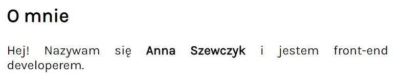
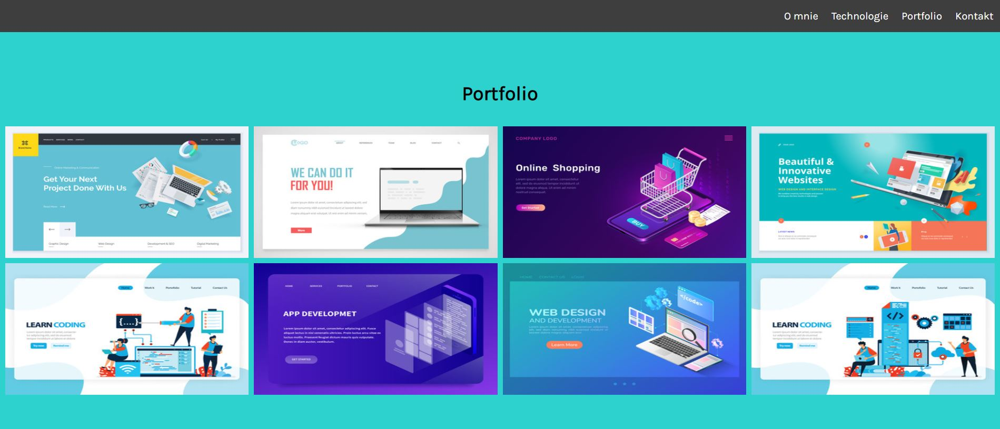
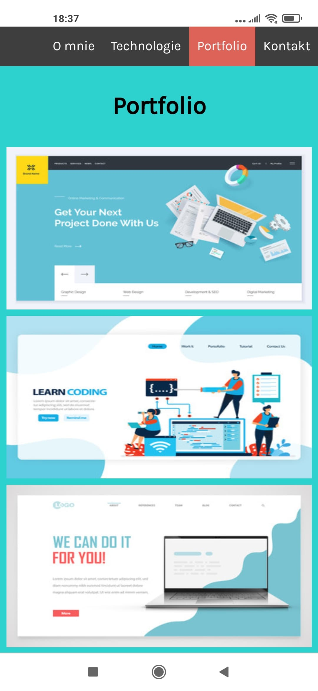
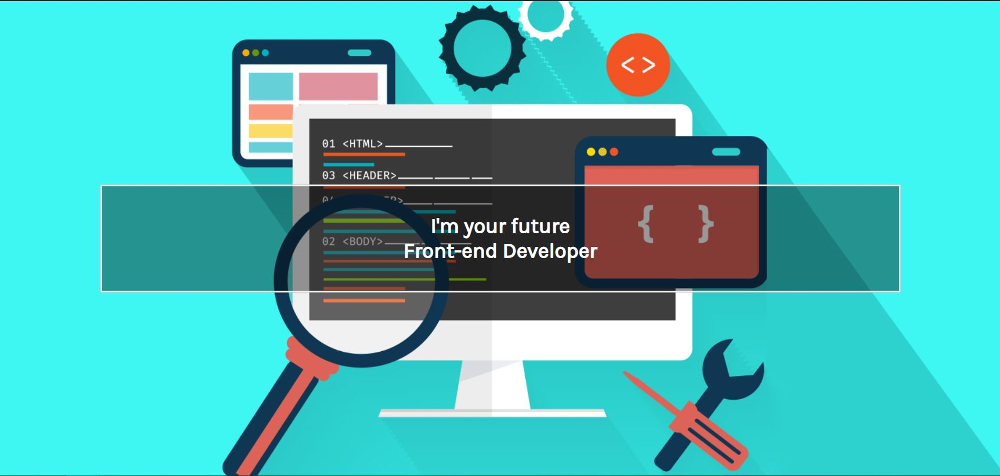
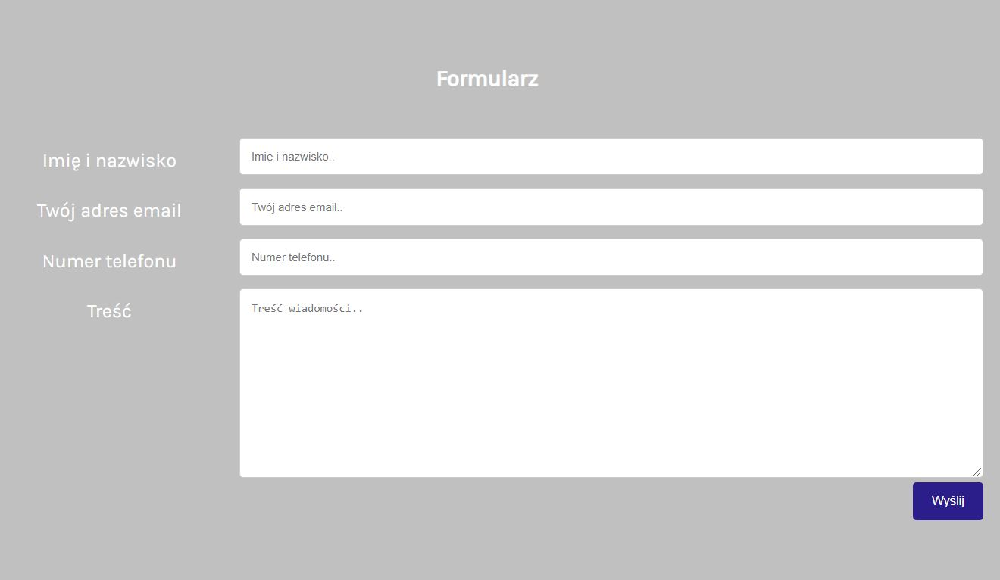
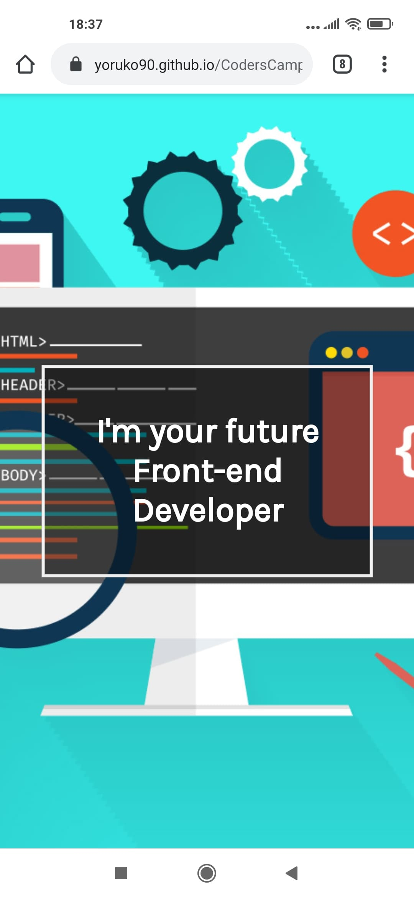
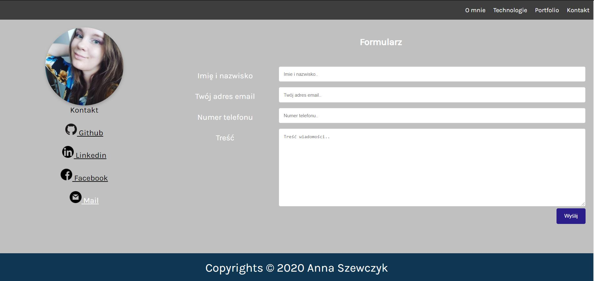
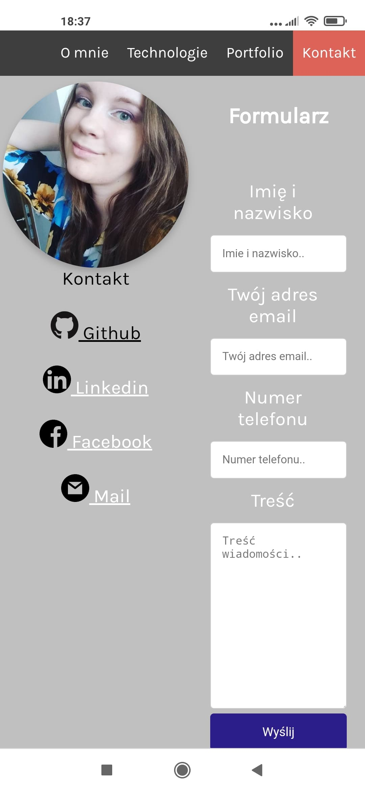

# CodersCamp 2020 - Projekt HTML & CSS

## Spis treści

1. Podstawowe informacje
2. Użyte technologie
3. Link do projektu
4. Treść strony
5. Zrealizowane założenia projektu
6. Przykłady realizacji założeń
7. Testowane przeglądarki
8. Pliki zewnętrzne

## Podstawowe informacje
* Projekt w ramach : [Coders Camp 2020](coderscamp.edu.pl "Coders Camp 2020")
* Autor : Anna Szewczyk
* Mentor : Radosław Bajor
* Projekt polegał na stworzeniu responsywnej strony internetowej o dowlonej tematyce, w oparciu jedynie o technologie HTML5 i CSS3. Projekt przedstawia moją wizytówkę. 

## Użyte technologie:
1. HTML5
2. CSS3

Projekt tworzony w Visual Studio Code Version 1.51.1.

## Link do Projektu:
* [Wizytówka](https://yoruko90.github.io/CodersCamp2020.Project.HTML-CSS.BusinessCard/ "Anna Szewczyk - Wizytówka")
* [Repozytorium](https://github.com/Yoruko90/CodersCamp2020.Project.HTML-CSS.BusinessCard/ "Repozytorium")

## Treść strony:
 
Strona została podzielona 4 główne sekcje :
* O mnie 
* Technologie 
* Portfolio  
* Kontakt

Poza wymienionymi sekcjami na stronie znajduje się pełnoekranowy header, menu nawigujace po stronie oraz stopka. 

## Zrealizowane założenia projektu:

* Box-model
* Kaskadowość CSS
* Selektory CSS 
* Popularne tagi HTML
* Podpinanie CSS'a do HTMLa
* Zapisywanie kolorów
* Stylowanie tekstu
* Zewnętrzne ikony/fonty
* Grid
* Flexbox 
* Position (absolute, relative, sticky)
* Animacje keyframes
* Formularz
* Responsive Web Designe

### Przykłady realizacj założeń:

* Popularne tagi HTML min.:
    * `<title>` 
    * `<link>` (podpięcie css, czcionki)
    * `<meta>` (metadane)
    * `` (zdjęcia na stronie)
    * `<a>` (linki na stronie)
    * `<h1>`, `<h3>`(nagłówki)
    * `
`
    * ``, `<strong>` 

* Podpinanie CSS'a do HTMLa
    * podpięcie w `<head>`
        * ` <link rel="stylesheet" href="style.css"> `
* Zapisywanie kolorów
    * użycie np : 
        * ` rgb( 192, 192, 192) `
        * ` #2980b9 ` , `#bbb`
        * `color : white `
* Stylowanie tekstu
    * zmiana koloru tekstów, dodanie ``, `<strong>` etc.
* Zewnętrzne fonty
    * [Karla](https://fonts.google.com/specimen/Karla "Karla")

* Grid
    * Sekcje O mnie, Technologie, Potrfolio, Kontakt i Formularz opracowane na gridzie. Użycie właściwości min: 
        * ` .grid-container {
                                display: grid;
                                grid-template-areas: 
                                'aboutMeT aboutMeT tech tech tech' 'gallery gallery gallery gallery gallery'
                                'contact form form form form'; }`
* Flexbox 
    * galeria projektów w Portfolio : 
    
    
    
* Position (absolute, relative, sticky)
    * menu nawigacyjne ustawione na sticky
    * obracanie zdjęcia w Kontakt - relative, absolute
* Animacje keyframes
    * animowany napis w header 
        * 
* Formularz
    * Formularz w kontakt 
        * 
* Responsive Web Design
    * Cała strona płynnie się zwęża do mniejszych rozdzielczości, elementy wyglądają czytelnie, w wersji o niższych rozdzielczościach zdjęcia z galerii Projektów zamiast w dwóch wierszach pokazują się jeden pod drugim

* Header
    * desktop
        
    * mobile 
        
* Kontakt
    * desktop
        
    * mobile 
        

## Testowane przeglądarki:
    
* Google Chrome Wersja 87.0.4280.88 (64-bitowa) 
* Google Chrome Wersja 87.0.4280.101 (Android) 
* Firefox Wersja: 84.0 (64 bity)
* Safari Wersja 13.0.4 (15608.4.9.1.3)
* Microsoft Edge  Wersja 87.0.664.66 (wersja 64-bitowa)

## Pliki zewnętrzne
* Wszelkie grafiki wyszukane w Google Graphics
* Font [Karla](https://fonts.google.com/specimen/Karla "Karla") z Google Fonts 